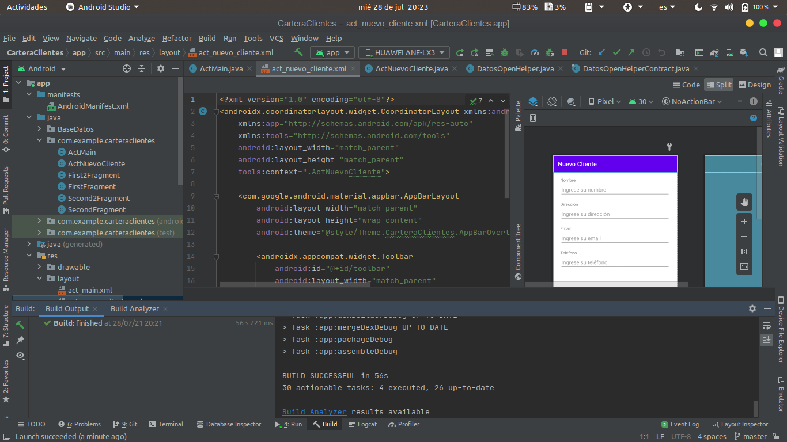
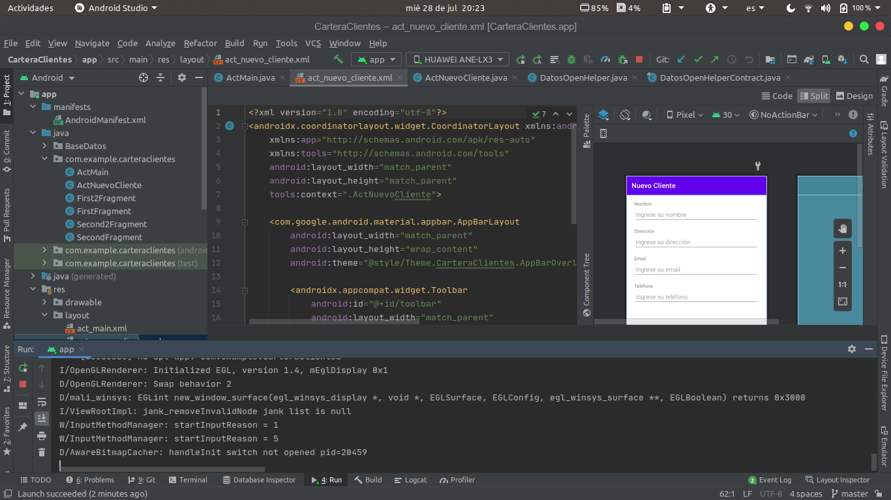
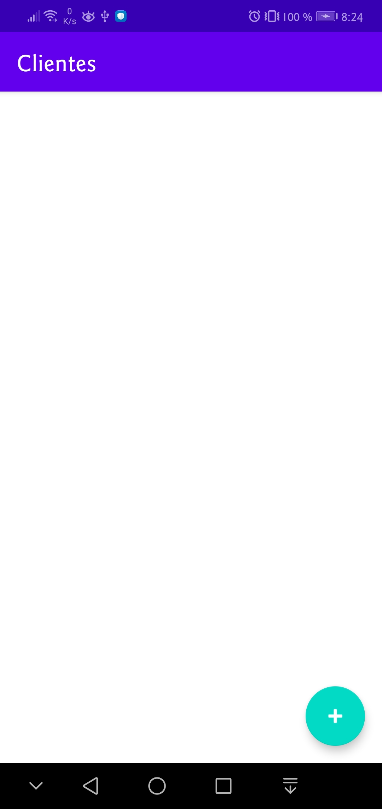
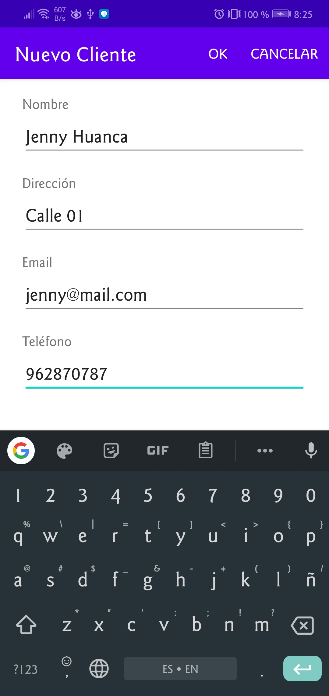
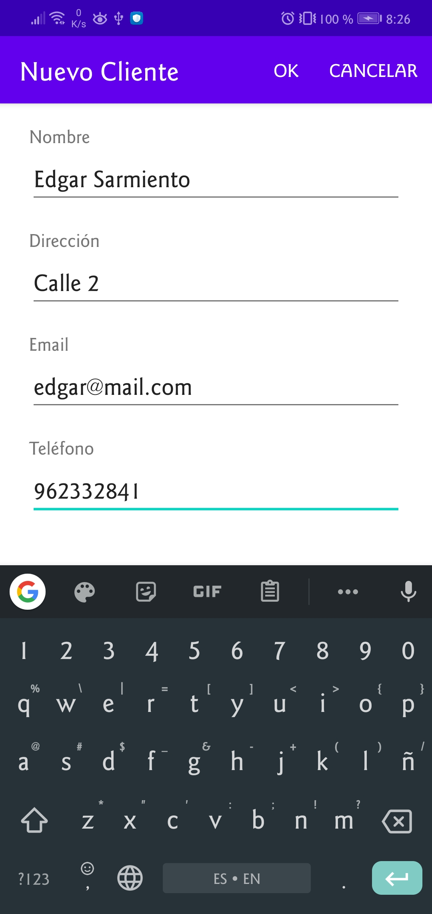
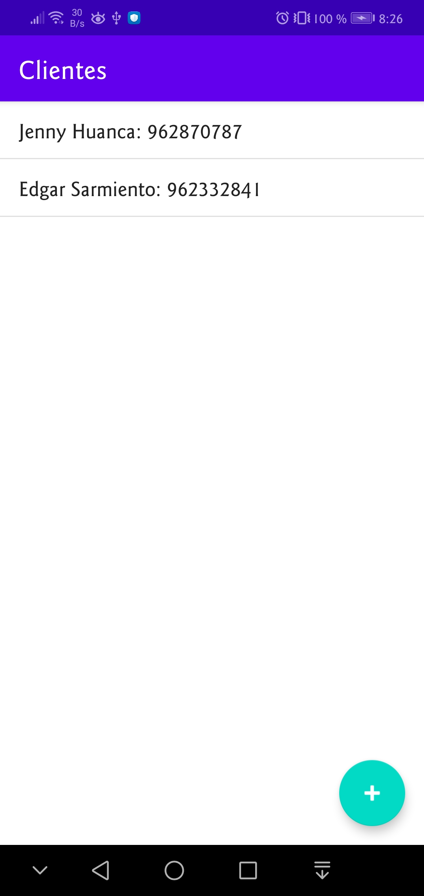

# Laboratorio 6: Android App + Base de Datos

**Objetivo:** Crear una aplicación Android con conexión a Base de Datos.

## Evidencias de Laboratorio

1. __Build successful__
   

2. __Run in device mobile__  
   

3. __Initial List__  
   

4. __Adding data__  
   
   

5. __List with Data__  
    
